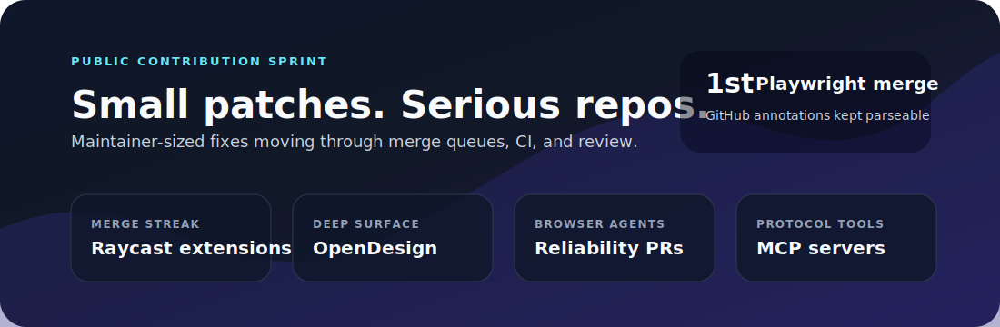
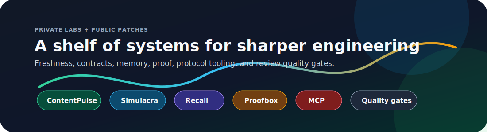

<h1 align="center">Mehmet Turaç · @mturac</h1>

  <b>Product judgment · engineering execution · agentic systems under production pressure</b>

  
  
  
  

  

I build the bridge between product judgment, engineering execution, and agentic systems that have to survive real production pressure.

Over 15+ years in software, I have led and advised product, engineering, and strategy teams through
platform bets, architecture risk, organizational complexity, and delivery pressure. My work is not only
about building systems; it is about deciding which systems are worth building, aligning people around
them, and carrying them into production.

I think like a product owner, operate like a strategist, and still stay close enough to the code to know where the system will break.
That is the lane I like most: unclear problem, real users, brittle architecture, impatient timeline, no room for theatre.

In 2026, while continuing my professional work, I made a deliberate turn back toward open source:
to help public engineering teams, contribute to systems I respect, and make my judgment visible in the open. I focus on
small, reviewable patches in serious repositories: reliability fixes, edge-case handling, type safety, UI correctness,
CI repair, and maintainer feedback loops.

I care about teams and agents that can take responsibility in real codebases, not just look impressive in a terminal.
Occasionally loud in Turkish.

---

#### June 2026 OSS sprint

Small patches, serious repositories, real review queues. The point is not volume for its own sake; it is maintainer-sized fixes that survive CI, review, and production-grade expectations.

| Signal | Where | What landed or is moving |
|---|---|---|
| 🎭 First Playwright merge | [microsoft/playwright#41292](https://github.com/microsoft/playwright/pull/41292) | Kept GitHub annotations parseable with the dot reporter. |
| 🚀 Merge streak | [raycast/extensions](https://github.com/raycast/extensions) | GitLab, Apple Reminders, Agent Usage, Music, 1Password, Apple Mail, Windows Terminal, VS Code recent projects, and more. |
| 🧠 Deep review surface | [nexu-io/open-design](https://github.com/nexu-io/open-design) | ACP session reuse, provider endpoint handling, localized automation UI, execution-card layout, review follow-through. |
| 🌐 Browser-agent reliability | [browser-use/browser-use](https://github.com/browser-use/browser-use) | Remote session lifetime, video artifact exposure, structured tool-call parsing. |
| 🧰 Protocol tooling | [modelcontextprotocol/servers](https://github.com/modelcontextprotocol/servers) | Runtime dependency correctness and filesystem search semantics. |
| 🧱 Frontend infrastructure | [twbs/bootstrap](https://github.com/twbs/bootstrap), [vercel/edge-runtime](https://github.com/vercel/edge-runtime) | Bootstrap docs/Sass polish and edge cookie parsing behavior. |
| ⚡ Maintainer queues | [bifrost](https://github.com/maximhq/bifrost), [OpenHands](https://github.com/OpenHands/OpenHands), [ollama](https://github.com/ollama/ollama), [strapi](https://github.com/strapi/strapi) | Smaller reliability patches moving through review. |

Private labs are active too: OSS scouting/factory systems, research automation, and contribution-quality gates that make the public work sharper without turning the profile into a private-link graveyard.

#### Builder shelf

  

The public repo shelf has two personalities: practical utilities that solve annoying engineering problems, and agentic systems that make autonomous work less fragile.

| Featured line | Projects | Why it exists |
|---|---|---|
| Content freshness | [content-pulse](https://github.com/mturac/content-pulse), [contentpulse-strapi](https://github.com/mturac/contentpulse-strapi), [contentpulse-contentful](https://github.com/mturac/contentpulse-contentful) | Find stale dates, version drift, and neglected content before users do. |
| Agent governance | [claude-roundtable](https://github.com/mturac/claude-roundtable), [promptguard](https://github.com/mturac/promptguard), [skill-hunter](https://github.com/mturac/skill-hunter) | Make coding agents check contracts, reuse skills, and pass quality gates. |
| Memory and proof | [recall-mcp](https://github.com/mturac/recall-mcp), [proofbox](https://github.com/mturac/proofbox), [eval-kit](https://github.com/mturac/eval-kit) | Turn vague agent confidence into persistent memory and repeatable checks. |
| Protocol tooling | [mcpx](https://github.com/mturac/mcpx), [mcp-guard](https://github.com/mturac/mcp-guard), [mcp-scaffold](https://github.com/mturac/mcp-scaffold) | Build, proxy, and harden MCP servers without pretending every tool call is safe. |

<b>Open the full public lab shelf</b> · utilities, plugins, guards, agents, and research toys

 

- 🔍 **[content-pulse](https://github.com/mturac/content-pulse)** — Semantic Decay & Freshness Engine for PayloadCMS v3. Detect stale dates and outdated version references before your readers do. 14/14 tests passing.
- 🔍 **[contentpulse-strapi](https://github.com/mturac/contentpulse-strapi)** — ContentPulse for Strapi v5. Lifecycle hooks + admin widget for content freshness analysis.
- 🔍 **[contentpulse-contentful](https://github.com/mturac/contentpulse-contentful)** — ContentPulse for Contentful. Sidebar app with Forma 36 design system integration.
- 👻 **[simulacra](https://github.com/mturac/simulacra)** — Ghost personas review your code before it ships. Find edge cases, race conditions, and business logic bugs before production.
- 🧠 **[sparse-attention-viz](https://github.com/mturac/sparse-attention-viz)** — MiniMax-style Top-k sparse attention visualizer. CPU-only, no GPU required.
- 🪑 **[claude-roundtable](https://github.com/mturac/claude-roundtable)** — Multi-agent governance for Claude Code. Council deliberates, votes, dispatches, and enforces quality gates.
- ⏱️ **[leyla-scheduler](https://github.com/mturac/leyla-scheduler)** — Durable, session-aware task scheduler in Rust. Jobs survive disconnects.
- 🔎 **[skill-hunter](https://github.com/mturac/skill-hunter)** — Pre-execution layer that makes agents check for existing skills before building from scratch.
- 🛡️ **[promptguard](https://github.com/mturac/promptguard)** — Audits prompts as behavioral contracts. Pre-write guard for agents that ship code.
- 🧠 **[recall-mcp](https://github.com/mturac/recall-mcp)** — Shared brain for AI agents. SQLite-backed persistent memory over MCP.
- 👵 **[moooom-claude](https://github.com/mturac/moooom-claude)** — 10 cultures of moms nagging your Claude Code to drink water and sit up straight.
- 🐍 **[hermes-supercode-skills](https://github.com/mturac/hermes-supercode-skills)** — 13 production-grade Claude Code skill modules: database, auth, observability, infra, security, deployment, debugging, API design, and more. Also available for [OpenAI Codex](https://github.com/mturac/hermes-supercode-skills-codex).
- 🧰 **[pluginpool](https://github.com/mturac/pluginpool)** — Ten focused Claude Code plugins for everyday developer productivity. Each one is its own MIT-licensed repo: [commit-narrator](https://github.com/mturac/pluginpool-commit-narrator), [pr-storyteller](https://github.com/mturac/pluginpool-pr-storyteller), [test-gap](https://github.com/mturac/pluginpool-test-gap), [deps-doctor](https://github.com/mturac/pluginpool-deps-doctor), [env-lint](https://github.com/mturac/pluginpool-env-lint), [secret-guard](https://github.com/mturac/pluginpool-secret-guard), [standup-gen](https://github.com/mturac/pluginpool-standup-gen), [todo-harvest](https://github.com/mturac/pluginpool-todo-harvest), [flaky-detector](https://github.com/mturac/pluginpool-flaky-detector), [changelog-forge](https://github.com/mturac/pluginpool-changelog-forge). 89 hermetic tests · Python 3 stdlib only.
- ♿ **[a11y-ci](https://github.com/mturac/a11y-ci)** — Automated accessibility audits for Claude Code. Static WCAG 2.1 checks on HTML, JSX/TSX, and Vue SFC — violations annotated in-source with line numbers and fix suggestions.
- 📐 **[adr-sync](https://github.com/mturac/adr-sync)** — Keeps Architecture Decision Records aligned with actual code changes. Detects drift between ADRs and implementation before it compounds.
- 💰 **[agent-budget](https://github.com/mturac/agent-budget)** — Track token spend and enforce cost budgets for LLM agent runs.
- 🔗 **[api-contract](https://github.com/mturac/api-contract)** — Validates frontend API calls against backend schemas, detects breaking changes before deploy, generates typed TypeScript clients.
- ⚡ **[build-cache-analyzer](https://github.com/mturac/build-cache-analyzer)** — Analyzes build cache hit rates across CI runs, finds what's busting your cache, and optimizes build times.
- 🏺 **[code-archaeologist](https://github.com/mturac/code-archaeologist)** — Uncovers intent and evolution in legacy codebases through git history, comments, and structural patterns.
- 👁️ **[codewatch](https://github.com/mturac/codewatch)** — Automated PR review and security auditing for Claude Code.
- ✅ **[config-schema-validator](https://github.com/mturac/config-schema-validator)** — Validates YAML, TOML, and JSON config files against schemas and suggests auto-fixes for common misconfigurations.
- 🗺️ **[contract-atlas](https://github.com/mturac/contract-atlas)** — Maps the implicit contracts in your codebase. You find out about them when they break — this finds them first.
- 💸 **[cost-watch](https://github.com/mturac/cost-watch)** — Token spend tracking and budget alerts for Claude Code sessions.
- 🚫 **[dead-end-finder](https://github.com/mturac/dead-end-finder)** — Discovers unreachable code, unused exports, and orphaned API endpoints that accumulate silently.
- 📦 **[dep-drift](https://github.com/mturac/dep-drift)** — Detects when your lockfile diverges from `package.json`, flags silent transitive dependency updates, and catches license incompatibilities before they become compliance issues.
- 🕸️ **[dependency-graph-viz](https://github.com/mturac/dependency-graph-viz)** — Builds import dependency graphs, detects circular dependencies, and analyzes deep chains that create brittle architectures.
- 🚀 **[deploy](https://github.com/mturac/deploy)** — Deploy to Vercel, Railway, Fly.io, or Render directly from your editor.
- 🍴 **[devfork](https://github.com/mturac/devfork)** — Git branch for your entire running dev environment. Switch context without killing your server.
- 📄 **[docs-sync-checker](https://github.com/mturac/docs-sync-checker)** — Detects documentation drift: when docs describe functions, CLI commands, file paths, or config keys that no longer exist or have changed.
- 🧪 **[eval-kit](https://github.com/mturac/eval-kit)** — Assertion-based prompt evaluation for LLMs. Test AI outputs like unit tests, run from the terminal.
- 🚩 **[flag-ops](https://github.com/mturac/flag-ops)** — Manage feature flags: scan for orphaned flags, track rollout status, and safely remove flags when done.
- 🎯 **[flaky-test-hunter](https://github.com/mturac/flaky-test-hunter)** — Detects, quarantines, and fixes flaky tests by analyzing CI run history and test timing patterns.
- 🌍 **[i18n-sync](https://github.com/mturac/i18n-sync)** — Keeps translation keys in sync across locales. Detects missing, extra, duplicate, and untranslated keys. Generates type-safe stubs and prunes orphaned entries.
- 🚨 **[incident](https://github.com/mturac/incident)** — Production incident response for Claude Code. Triage fast, diagnose deep, fix correctly, document thoroughly.
- ⚖️ **[license-guard](https://github.com/mturac/license-guard)** — Enforces license compliance policy on dependencies, generates SBOM, and blocks incompatible licenses before they reach production.
- 🧹 **[llmfmt](https://github.com/mturac/llmfmt)** — Normalizes LLM output: extracts JSON, code blocks, strips markdown, removes thinking tags, and unwraps common prose prefixes.
- 🏗️ **[mcp-scaffold](https://github.com/mturac/mcp-scaffold)** — Scaffold production-ready MCP servers in seconds — stdio, multi-tool, and HTTP templates included.
- 🧠 **[memex](https://github.com/mturac/memex)** — Personal semantic memory for claude.ai. Save notes, links, code snippets, and ideas — search and recall them in any conversation via a knowledge graph.
- 🗄️ **[migrate-safe](https://github.com/mturac/migrate-safe)** — Analyzes database migrations for destructive operations and safety issues before you run them.
- 🔍 **[perf-lens](https://github.com/mturac/perf-lens)** — Identifies N+1 query patterns, redundant React re-renders, and bundle bloat before they hit production.
- 🔬 **[promptlab](https://github.com/mturac/promptlab)** — Zero-backend visual prompt engineering studio. Multi-model comparison, variable interpolation, eval assertions, and shareable URLs.
- 🔄 **[refactor-preview](https://github.com/mturac/refactor-preview)** — Simulates refactoring impact with blast radius analysis before applying changes — see exactly what would break.
- ⏮️ **[replay](https://github.com/mturac/replay)** — Records and replays Claude Code agent runs. Every bash command, file read/write, and tool call logged to SQLite. Inspect, diff, and audit any past session.
- ⚗️ **[schema-forge](https://github.com/mturac/schema-forge)** — Generates Zod schemas from JSON examples, OpenAPI specs, and JSON Schema definitions.
- 📝 **[semantic-release-notes](https://github.com/mturac/semantic-release-notes)** — Auto-generates human-readable changelogs and release notes from conventional commits and PR titles.
- 🔭 **[test-scout](https://github.com/mturac/test-scout)** — Finds untested code paths and generates targeted unit tests by analyzing coverage gaps and control flow.
- 🏷️ **[type-coverage](https://github.com/mturac/type-coverage)** — Tracks TypeScript type safety across your codebase. Surface where `any` is spreading.
- 🎨 **[open-design](https://github.com/mturac/open-design)** — Local-first open-source alternative to Anthropic's Claude Design. 19 skills · 71 brand-grade design systems · generates web, desktop, mobile prototypes, slides, images, and video. Runs on Claude Code, Codex, Cursor, Gemini, OpenCode, Qwen, Copilot, Hermes, and Kimi CLI.
- 🔬 **[proofbox](https://github.com/mturac/proofbox)** — Verify AI-generated technical recipes before engineering teams trust them.
- 🌊 **[weave](https://github.com/mturac/weave)** — Visual AI-agent flow builder with real LLM execution and Python export.
- 🔀 **[mcpx](https://github.com/mturac/mcpx)** — MCP gateway that proxies and routes multiple MCP servers behind one endpoint.
- 🛂 **[mcp-guard](https://github.com/mturac/mcp-guard)** — Policy firewall and security scanner for MCP servers and agent tools.
- 🧹 **[debtlint](https://github.com/mturac/debtlint)** — Vibe debt scanner: AI attribution and code ownership tracker.
- 🎭 **[multichar-studio](https://github.com/mturac/multichar-studio)** — Local-first multi-character AI scene studio with shared and subjective memory.
- 🧰 **[awesome-claude-code-toolkit](https://github.com/mturac/awesome-claude-code-toolkit)** — The most comprehensive Claude Code toolkit: 135 agents, 35 curated skills, 42 commands, 176+ plugins, 20 hooks, 15 rules, 7 templates, 14 MCP configs, 26 companion apps, and 52 ecosystem entries.

#### Academic Papers

- 📄 [OpenArXiv: 20260524.1](https://openarxiv.org/doc/20260524.1) — Research paper on agent systems and formal methods.
- 📄 [OpenArXiv: 20260524.2](https://openarxiv.org/doc/20260524.2) — Research paper on semantic mathematics for LLM meaning.

#### Writing

| Series | Shape |
|---|---|
| **Scale Wars** | Architecture lessons from large-scale product companies. |
| **Back to Code** | A 15-episode technical novel about recovering engineering craft after the AI illusion. |
| **AI Agents & LLMs** | Practical essays on agent failure modes, memory, reflection, and trust. |
| **Software Engineering** | Production stories about tests, delivery pressure, and systems that survive contact with users. |

<b>Open the writing archive</b> · LinkedIn, Dev.to series, papers, and essays

 

**LinkedIn**
- 🗡️ [Çift Yüzlü Katana: Yapay Zeka Dönüşümlerinin Gerçekçi Bir Analizi](https://www.linkedin.com/pulse/%C3%A7ift-y%C3%BCzl%C3%BC-katana-yapay-zeka-d%C3%B6n%C3%BC%C5%9F%C3%BCmlerinin-ger%C3%A7ek%C3%A7i-bir-mehmet-turac-80h7f) — AI transformations realistic analysis. The 5 illusions that compound into expensive, fragile systems.
- 📄 [LinkedIn Articles](https://www.linkedin.com/in/mehmetturac/recent-activity/articles/) — All published articles
- 📊 [LinkedIn Documents](https://www.linkedin.com/in/mehmetturac/recent-activity/documents/) — Research papers and technical documents

**Dev.to** — [All 39 Articles](https://dev.to/turacthethinker)

***Scale Wars*** *— The Architectural Secrets of Tech Giants*
- [Scale Wars — The Architectural Secrets of Tech Giants](https://dev.to/turacthethinker/scale-wars-the-architectural-secrets-of-tech-giants-2g4a)
- [#1 Netflix: The Company That Killed the Monolith](https://dev.to/turacthethinker/scale-wars-1-netflix-the-company-that-killed-the-monolith-50d7)
- [#2 Uber: How They Processed 100 Billion Events Per Day](https://dev.to/turacthethinker/scale-wars-2-uber-how-they-processed-100-billion-events-per-day-1cdb)
- [#3 Amazon: Two-Pizza Teams and the SOA Manifesto](https://dev.to/turacthethinker/scale-wars-3-amazon-two-pizza-teams-and-the-soa-manifesto-15j7)
- [#4 Airbnb: Data Mesh and the Death of the Central Data Team](https://dev.to/turacthethinker/scale-wars-4-airbnb-data-mesh-and-the-death-of-the-central-data-team-dn0)
- [#5 Twitter: The Fan-out Pattern and the Architecture Behind 140 Characters](https://dev.to/turacthethinker/scale-wars-5-twitter-the-fan-out-pattern-and-the-architecture-behind-140-characters-bpg)
- [#6 Spotify: The Squad Model and the Power of Golden Paths](https://dev.to/turacthethinker/scale-wars-6-spotify-the-squad-model-and-the-power-of-golden-paths-4poa)
- [#7 What We Learned from the Giants (Series Finale)](https://dev.to/turacthethinker/scale-wars-7-what-we-learned-from-the-giants-series-finale-2d9f)

***Back to Code*** *— A 15-Episode Technical Novel About Waking Up From the AI Illusion*
- [I Wrote a 15-Episode Technical Novel About Waking Up From the AI Illusion](https://dev.to/turacthethinker/i-wrote-a-15-episode-technical-novel-about-waking-up-from-the-ai-illusion-2iee)
- [Ep 01: The Invoice of Illusion and the Black Friday Crash](https://dev.to/turacthethinker/back-to-code-ep-01-the-invoice-of-illusion-and-the-black-friday-crash-5eec)
- [Ep 02: Autopsy — The Lie That Looked Flawless](https://dev.to/turacthethinker/back-to-code-ep-02-autopsy-the-lie-that-looked-flawless-4llm)
- [Ep 03: The Lost Craft — TDD and False Confidence](https://dev.to/turacthethinker/back-to-code-ep-03-the-lost-craft-tdd-and-false-confidence-4chi)
- [Ep 04: Forgetting the Machine — Big O and the Performance Tax](https://dev.to/turacthethinker/back-to-code-ep-04-forgetting-the-machine-big-o-and-the-performance-tax-28bk)
- [Ep 05: The Revenge of Context — DDD and Bounded Contexts](https://dev.to/turacthethinker/back-to-code-ep-05-the-revenge-of-context-ddd-and-bounded-contexts-1864)
- [Ep 06: State Hell and Idempotency](https://dev.to/turacthethinker/back-to-code-ep-06-state-hell-and-idempotency-4166)
- [Ep 07: The Lies of Mocks — Reality with Testcontainers](https://dev.to/turacthethinker/back-to-code-ep-07-the-lies-of-mocks-reality-with-testcontainers-28ao)
- [Ep 08: The Illusion of Type Safety](https://dev.to/turacthethinker/back-to-code-ep-08-the-illusion-of-type-safety-3ddk)
- [Ep 09: CI/CD Pipeline and Flaky Tests](https://dev.to/turacthethinker/back-to-code-ep-09-cicd-pipeline-and-flaky-tests-1m31)
- [Ep 10: The Security Vulnerability Factory](https://dev.to/turacthethinker/back-to-code-ep-10-the-security-vulnerability-factory-a5g)
- [Ep 11: The Legacy Code Mine — Strangler Fig Pattern](https://dev.to/turacthethinker/back-to-code-ep-11-the-legacy-code-mine-strangler-fig-pattern-2i9n)
- [Ep 12: Observability — From Log Spaghetti to Traces](https://dev.to/turacthethinker/back-to-code-ep-12-observability-from-log-spaghetti-to-traces-54jg)
- [Ep 13: Event-Driven Architecture — Kafka and the Async World](https://dev.to/turacthethinker/back-to-code-ep-13-event-driven-architecture-kafka-and-the-async-world-1f9p)
- [Ep 14: Technical Debt Credit Score — Measuring the Unmeasurable](https://dev.to/turacthethinker/back-to-code-ep-14-technical-debt-credit-score-measuring-the-unmeasurable-42a3)
- [Ep 15: The New Manifesto — Master and Apprentice (Season Finale)](https://dev.to/turacthethinker/back-to-code-ep-15-the-new-manifesto-master-and-apprentice-season-finale-4moo)

***AI Agents & LLMs***
- [eoc: Building the Operating System for OpenAI Codex — 230+ Skills, 60 Agents](https://dev.to/turacthethinker/ecc-building-the-operating-system-for-ai-coding-agents-230-skills-60-agents-cross-harness-39pc)
- [Why AI Agents Fail?](https://dev.to/turacthethinker/why-ai-agents-fail-ddg)
- [Your Agent Isn't Reflecting. It's Performing Reflection.](https://dev.to/turacthethinker/your-agent-isnt-reflecting-its-performing-reflection-b41)
- [How I Stopped My AI Agent From Reinventing the Wheel](https://dev.to/turacthethinker/how-i-stopped-my-ai-agent-from-reinventing-the-wheel-24eo)
- [Stop Your AI Agent From Building Tools That Already Exist](https://dev.to/turacthethinker/stop-your-ai-agent-from-building-tools-that-already-exist-6o9)
- [Hermes vs OpenClaw: Which AI assistant would you actually trust?](https://dev.to/turacthethinker/hermes-vs-openclaw-which-ai-assistant-would-you-actually-trust-bbl)

***LLM & Memory Systems***
- [The Context Window Lie: Why Your LLM Remembers Nothing](https://dev.to/turacthethinker/the-context-window-lie-why-your-llm-remembers-nothing-5h1p)
- [Why Versioned SQL Beats Vector RAG for Agent Memory Systems](https://dev.to/turacthethinker/why-versioned-sql-beats-vector-rag-for-agent-memory-systems-1jo3)
- [Strategic LLM Adoption: A Director's Guide to Fine-Tuning Models](https://dev.to/turacthethinker/strategic-llm-adoption-a-directors-guide-to-fine-tuning-models-for-domain-specific-applications-4e37)
- [I Got Access to 136 AI Models for Free — NVIDIA NIM API Deep Dive](https://dev.to/turacthethinker/i-got-access-to-136-ai-models-for-free-nvidia-nim-api-deep-dive-111o)

***Software Engineering***
- [We Ship to Production Without Tests. Here's How It Destroyed Us.](https://dev.to/turacthethinker/we-ship-to-production-without-tests-heres-how-it-destroyed-us-i4i)
- [I built a product in one AI session. Here's the system that made it ship right.](https://dev.to/turacthethinker/i-built-a-product-in-one-ai-session-heres-the-system-that-made-it-ship-right-3mb3)
- [Remote Work Didn't Break Productivity — It Broke Human Connection](https://dev.to/turacthethinker/remote-work-didnt-break-productivity-it-broke-human-connection-288o)

#### Currently contributing to

External projects I'm actively shipping PRs into — open, merged, or in review. All public, all linkable.
The pattern is simple: find a real bug, reduce it to a maintainer-sized patch, validate it, stay through review.

| Contribution lane | Repositories |
|---|---|
| Major platform/runtime work | [Playwright](https://github.com/microsoft/playwright), [Ollama](https://github.com/ollama/ollama), [Strapi](https://github.com/strapi/strapi), [Grafana](https://github.com/grafana/grafana), [pnpm](https://github.com/pnpm/pnpm) |
| Agentic developer tools | [browser-use](https://github.com/browser-use/browser-use), [OpenHands](https://github.com/OpenHands/OpenHands), [cline](https://github.com/cline/cline), [kilocode](https://github.com/Kilo-Org/kilocode), [cherry-studio](https://github.com/CherryHQ/cherry-studio) |
| Protocol and infrastructure | [modelcontextprotocol/servers](https://github.com/modelcontextprotocol/servers), [envoyproxy/ai-gateway](https://github.com/envoyproxy/ai-gateway), [project-zot/zot](https://github.com/project-zot/zot), [actions/github-script](https://github.com/actions/github-script) |
| Heavy review surfaces | [nexu-io/open-design](https://github.com/nexu-io/open-design), [raycast/extensions](https://github.com/raycast/extensions), [nexu-io/looper](https://github.com/nexu-io/looper) |

<b>Open the full external contribution map</b> · merged, open, and in-review PR surfaces

 

**Major OSS projects**

- 🎭 **[microsoft/playwright](https://github.com/microsoft/playwright)** — first merged Playwright contribution: kept GitHub annotations parseable with the dot reporter.
- 🌐 **[google-gemini/gemini-cli](https://github.com/google-gemini/gemini-cli)** — Google's official Gemini terminal agent. CLI ergonomics fix (session-ID rendering in resume messages).
- 🦙 **[ollama/ollama](https://github.com/ollama/ollama)** — local LLM runtime. Docs fixes (GPU FAQ link, Linux context-length config) and a ggml LoongArch quantization source PR.
- 🔎 **[elastic/elasticsearch](https://github.com/elastic/elasticsearch)** — ESQL `InvalidMappedField` equality metadata fix.
- 📊 **[elastic/kibana](https://github.com/elastic/kibana)** — Fleet UI: use "Failed" label for failed integration status.
- 📦 **[elastic/elastic-package](https://github.com/elastic/elastic-package)** — system-test query for ignored fields.
- 🛰️ **[elastic/elastic-agent](https://github.com/elastic/elastic-agent)** — `os.Remove` error guards in symlink/marker/enrollment cleanup paths.
- ☁️ **[cloudflare/wrangler-action](https://github.com/cloudflare/wrangler-action)** — docs: add missing install and build steps to the canonical example.
- 🧱 **[strapi/strapi](https://github.com/strapi/strapi)** — four reliability fixes: review-workflows stages for unsaved locales, media-url refresh on replacement, null `adminUserOwner` in api-token service, and content-manager locale resolution for non-i18n delete paths.
- 📈 **[grafana/grafana](https://github.com/grafana/grafana)** — frontend reliability fixes across dashboard variables, logs, legends, query editors, and image-render export flows.
- 🛒 **[medusajs/medusa](https://github.com/medusajs/medusa)** — types fix: compound-word pluralization handling for uncountable suffixes.
- 🛡️ **[open-webui/open-webui](https://github.com/open-webui/open-webui)** — null-check in `upload_image` to prevent crashes when SSRF protection blocks a fetch.
- ☸️ **[kubestellar/console](https://github.com/kubestellar/console)** — store fix: use `make([]T, 0)` instead of `var x []T` for nil-safe JSON.
- 🛂 **[envoyproxy/ai-gateway](https://github.com/envoyproxy/ai-gateway)** — per-backend HTTPRoute cluster-name handling.
- 🤖 **[langgenius/dify](https://github.com/langgenius/dify)** — error class cleanup (removed unnecessary `| None` from typed error returns).
- 🤓 **[Aider-AI/aider](https://github.com/Aider-AI/aider)** — accept `model-settings-file` in benchmark mode.
- 🚦 **[maximhq/bifrost](https://github.com/maximhq/bifrost)** — return proper 400 for schema parse errors.
- 🔐 **[project-zot/zot](https://github.com/project-zot/zot)** — skip DynamoDB table creation when tables already exist.
- 🐙 **[oraios/serena](https://github.com/oraios/serena)** — empty `projects` config-key handling.
- 🎨 **[shadcn-ui/ui](https://github.com/shadcn-ui/ui)** — `shrink-0` fix on `base-luma SelectContent` so the component sizes correctly inside flex layouts.
- 🚀 **[raycast/extensions](https://github.com/raycast/extensions)** — productivity-extension fixes for Jira, VS Code recent projects, Google Workspace, 1Password, Sentry, Spotify, Browser Bookmarks, Git Repos, ccusage, and more.
- ⚙️ **[actions/github-script](https://github.com/actions/github-script)** — feature: `working-directory` input to change script execution directory.
- 🧱 **[twbs/bootstrap](https://github.com/twbs/bootstrap)** — docs and Sass fixes for carousel API wording and list-group action colors.
- 🌐 **[vercel/edge-runtime](https://github.com/vercel/edge-runtime)** — cookie parsing fix for percent-encoded `Set-Cookie` values.
- 📦 **[pnpm/pnpm](https://github.com/pnpm/pnpm)** — package-manager reliability fixes: trusted-publisher provenance checks, non-root `resolutions` warnings, fish shell setup location, and complete global-update summaries.
- 📚 **[pnpm/pnpm.io](https://github.com/pnpm/pnpm.io)** — docs fixes for version-pinned v11 examples and zsh completion setup.
- 🕷️ **[firecrawl/firecrawl](https://github.com/firecrawl/firecrawl)** — scraper fix: pass `fullPage` option to fire-engine request.
- ✨ **[refined-github/refined-github](https://github.com/refined-github/refined-github)** — fix on the most-downloaded GitHub UX-improvement extension.
- 🧩 **[gfazioli/mantine-split-pane](https://github.com/gfazioli/mantine-split-pane)** — resizer fix: fire `onResizing` and `onResizeEnd` on double-click reset.
- 📝 **[refactoringhq/tolaria](https://github.com/refactoringhq/tolaria)** — desktop markdown knowledge-base app fixes: responsive status-bar stacking, Kiro agent-target selection, and local-only git remote handling.

**Agentic developer tools**

- 🌐 **[browser-use/browser-use](https://github.com/browser-use/browser-use)** — browser-agent reliability patches around remote session lifetime, video artifacts, and structured tool-call parsing.
- 🧰 **[modelcontextprotocol/servers](https://github.com/modelcontextprotocol/servers)** — runtime dependency and filesystem-tool behavior fixes for official MCP servers.
- 🧪 **[OpenHands/OpenHands](https://github.com/OpenHands/OpenHands)** — enterprise and repository-search fixes moving through review.
- 🧠 **[cline/cline](https://github.com/cline/cline)** — VS Code and CLI agent fixes: completed-task resume state after hooks, command approval handling, context overflow detection, TLS opt-out handling, skill-picker render keys, settings/account setup flow, and config-view hook dependencies.
- 🟣 **[Kilo-Org/kilocode](https://github.com/Kilo-Org/kilocode)** — CLI and VS Code agent fixes across permission docks, diff previews, export dialogs, startup migrations, paste summaries, offline model fetches, reasoning effort options, subagent prompts, autocomplete, and dependency-context filtering.
- 🍒 **[CherryHQ/cherry-studio](https://github.com/CherryHQ/cherry-studio)** — desktop AI client fixes for MCP structured content, cron/local-time tool responses, miniapp URL refresh, CherryIN provider aliasing, and thinking-segment stream handling.
- 🧩 **opencode ecosystem** — [opencode.nvim](https://github.com/nickjvandyke/opencode.nvim) (edit-diff buffer cleanup, immediate interrupt commands), [opencode-manager](https://github.com/chriswritescode-dev/opencode-manager) (repo-action tooltips, config-refresh model-form preservation), and [anomalyco/opencode](https://github.com/anomalyco/opencode) (run-root cwd, hyphenated MCP tool-id normalization).
- 🧰 **openclaw ecosystem** — [openclaw/openclaw](https://github.com/openclaw/openclaw) (pnpm baileys/libsignal git-deps, agent-runtime inheritance) and [openclaw/wacli](https://github.com/openclaw/wacli) (NativeFlowMessage button extraction).
- 🛠️ **MCP ecosystem** — [tosin2013/mcp-adr-analysis-server](https://github.com/tosin2013/mcp-adr-analysis-server) (issue templates), [IN3PIRE/github-health-monitor-mcp](https://github.com/IN3PIRE/github-health-monitor-mcp) (clearer rate-limit errors).
- 🪟 **Claude Code tooling** — [YishenTu/claudian](https://github.com/YishenTu/claudian) (recover from invalid settings JSON), [mksglu/context-mode](https://github.com/mksglu/context-mode) (atomic native-binary swap), [slopus/happy](https://github.com/slopus/happy) (missing-agent-key recovery), [steipete/CodexBar](https://github.com/steipete/CodexBar) (Kimi K2 provider note).
- 🌀 **Agent infra** — [manaflow-ai/cmux](https://github.com/manaflow-ai/cmux) (install Gemini feed hook with BeforeTool), [getpaseo/paseo](https://github.com/getpaseo/paseo), [floatpane/matcha](https://github.com/floatpane/matcha), [recurram/recurram-zig](https://github.com/recurram/recurram-zig) (workflow-token permissions).

**Heaviest external engagements**

- 🔧 **[nexu-io/open-design](https://github.com/nexu-io/open-design)** — design-tooling daemon, largest external contribution surface (12+ merged + open PRs): zip import-failure surfacing, manual edit tabs, Claude smoke-test stream-json wiring, draw-overlay scroll, comment-marker alignment, picker hints, design-files panel grouping, memory-editor reveal, plugin-publish footer, and more.
- 🎬 **[nexu-io/looper](https://github.com/nexu-io/looper)** — sequencer for long-running agent loops. PR-merge-blocker UI, pause/unpause commands, timing-sensitive test relaxations.

**Skills distribution**

Authored **`recsys-pipeline-architect`** and shepherded it into ~25 public skill / agent registries spanning the Anglophone, Chinese, and Turkish Claude communities: [vercel-labs/skills](https://github.com/vercel-labs/skills), [wshobson/agents](https://github.com/wshobson/agents), [github/awesome-copilot](https://github.com/github/awesome-copilot), [davila7/claude-code-templates](https://github.com/davila7/claude-code-templates), [karanb192/awesome-claude-skills](https://github.com/karanb192/awesome-claude-skills), [VoltAgent/awesome-agent-skills](https://github.com/VoltAgent/awesome-agent-skills), [ComposioHQ/awesome-codex-skills](https://github.com/ComposioHQ/awesome-codex-skills), [RoggeOhta/awesome-codex-cli](https://github.com/RoggeOhta/awesome-codex-cli), [ikaijua/Awesome-AITools](https://github.com/ikaijua/Awesome-AITools), [Prat011/awesome-llm-skills](https://github.com/Prat011/awesome-llm-skills), [skillmatic-ai/awesome-agent-skills](https://github.com/skillmatic-ai/awesome-agent-skills), [heilcheng/awesome-agent-skills](https://github.com/heilcheng/awesome-agent-skills), [kodustech/awesome-agent-skills](https://github.com/kodustech/awesome-agent-skills), [libukai/awesome-agent-skills](https://github.com/libukai/awesome-agent-skills) (CN), [laolaoshiren/claude-code-skills-zh](https://github.com/laolaoshiren/claude-code-skills-zh) (CN), [travisvn/awesome-claude-skills](https://github.com/travisvn/awesome-claude-skills), [BehiSecc/awesome-claude-skills](https://github.com/BehiSecc/awesome-claude-skills), [ComposioHQ/awesome-claude-skills](https://github.com/ComposioHQ/awesome-claude-skills), [rohitg00/awesome-claude-code-toolkit](https://github.com/rohitg00/awesome-claude-code-toolkit), [jqueryscript/awesome-claude-code](https://github.com/jqueryscript/awesome-claude-code), [GetBindu/awesome-claude-code-and-skills](https://github.com/GetBindu/awesome-claude-code-and-skills), [spencerpauly/awesome-cursor-skills](https://github.com/spencerpauly/awesome-cursor-skills), [shanraisshan/claude-code-best-practice](https://github.com/shanraisshan/claude-code-best-practice), [jeremylongshore/claude-code-plugins-plus-skills](https://github.com/jeremylongshore/claude-code-plugins-plus-skills), [Chat2AnyLLM/awesome-repo-configs](https://github.com/Chat2AnyLLM/awesome-repo-configs), [sickn33/antigravity-awesome-skills](https://github.com/sickn33/antigravity-awesome-skills), [affaan-m/everything-claude-code](https://github.com/affaan-m/everything-claude-code), [gmh5225/awesome-skills](https://github.com/gmh5225/awesome-skills).

#### Leadership mode

- Leading or advising product, engineering, and strategy teams larger than 15 people for nearly 15 years.
- Leading product and engineering teams through ambiguity, delivery pressure, and architecture risk.
- Advising multi-disciplinary teams where product direction, technical strategy, and execution discipline have to move together.
- Turning fuzzy product direction into executable systems.
- Seeing the strategy, user workflow, and failure mode in the same frame.
- Choosing the next useful move when everyone else is still debating abstractions.
- Raising the bar without slowing the room down.
- Turning vague bug reports into concrete failing cases.
- Finding the smallest patch that a maintainer can actually review.
- Shipping the unglamorous layer that makes ambitious systems trustworthy: tests, migrations, edge cases, review fixes, and clean rollback paths.
- Building guardrails so agents do not silently improvise their way into production.
- Staying with the boring part: CI, review comments, rework, and merge readiness.

#### Research taste

I come from a mathematical way of thinking: definitions first, invariants second, implementation third.
My research line connects product strategy with formal systems for AI agents:

- **TeserracT** — policy-constrained stochastic control, type-level governance, and market economics for multi-tenant agent platforms.
- **Miray Tesseractic Mathematics** — a semantic mathematics program for LLM meaning across geometry, energy, topology, type theory, memory, and human impact.
- **Gated Persona Intelligence** — stability-controlled persona memory for LLM systems; entropy gates, sigmoid smoothing, hysteresis, and deterministic cognitive state engines that reduce drift in long-running agent interactions.

That background shapes how I design products: formal enough to reason about, practical enough to ship.

#### What I think about

The interesting failures in agent systems are not capability gaps — they are accountability gaps.
Agents do not push back on scope. Memories drift into summaries. Self-correction is theatre without external validators.
I write infrastructure that turns those soft failures into hard ones: a council that has to vote, a scheduler that has to resume, a guard that has to read the contract before the agent ships.

The goal is simple and hard: agents that can survive contact with real repositories, real tests, and real maintainers.

#### Stack

`Product leadership` · `Technical strategy` · `Agent systems` · `Rust` · `Go` · `TypeScript / Next.js` · `Python` · `.NET / C#` · `SQLite` · `MCP` · `LLM evaluation`

#### Elsewhere

- 𝕏 [@TuracTheThinker](https://x.com/TuracTheThinker)
- ✍️ [Dev.to · TuracTheThinker](https://dev.to/turacthethinker)
- 💼 [LinkedIn](https://www.linkedin.com/in/mehmetturac/)
- 📄 [LinkedIn Articles](https://www.linkedin.com/in/mehmetturac/recent-activity/articles/)
- 📊 [LinkedIn Documents](https://www.linkedin.com/in/mehmetturac/recent-activity/documents/)

---

> _"Code is universal. Some commit messages are in Turkish. Make peace with it."_
